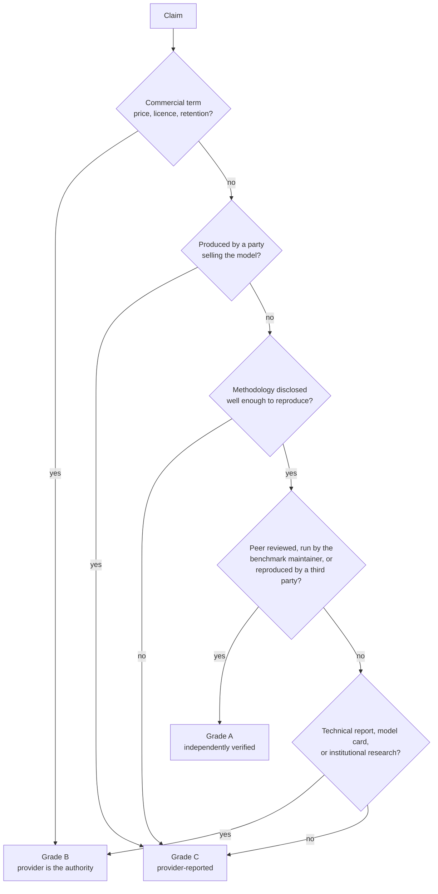

# Source quality framework

> **Research cut-off date: 2026-07-22.**

The operational procedure for assigning an evidence grade. The [research methodology](https://github.com/Ethical-Tech-CoLab/AI-Models-Research/blob/main/research-methodology.md#4-evidence-grading) defines the three grades; this page defines how to apply them, including the cases where the answer is not obvious.

Grading is the load-bearing operation in this repository. Everything downstream, including which results may be ranked against which, follows from it, so the procedure is written to be applied identically by different contributors rather than to be judged case by case.

## 1. The grades

**Grade A, independently verified.** The result was produced or reproduced by a party with no commercial interest in the outcome, under a disclosed methodology.

**Grade B, institutional primary research.** The result or specification comes from the originating institution under a documented methodology, without independent replication.

**Grade C, provider-reported.** The claim originates with the commercial party that benefits from it, typically under conditions that are incompletely disclosed.

## 2. The decision procedure

Apply these questions in order. Stop at the first that determines the grade.

1. **Does the claim concern the commercial terms of a product, such as price, licence, rate limit, or data retention?** If so, official documentation from the provider is **Grade B**, because the provider is the definitive authority on its own terms. Proceed no further.
2. **Who produced the measurement?** If the party that produced it sells the model or a service built on it, the grade is at most **C**, regardless of the venue in which it was published. A provider result published in a peer-reviewed paper is still a provider result if no independent party reproduced it.
3. **Is the methodology disclosed in enough detail to reproduce?** If not, the grade is at most **C**, regardless of who produced it. An independent evaluator who does not publish their harness, prompts, and sampling policy has produced an anecdote, not a measurement.
4. **Was the result peer reviewed, or produced by the benchmark's own maintainers under their published protocol, or reproduced by a third party?** If yes, **Grade A**.
5. **Is it a technical report, model card, architecture disclosure, or university research report, documented but not independently replicated?** If yes, **Grade B**.
6. **Otherwise, Grade C.**

## 3. Grade the evidence, not the organisation

The most frequent grading error is treating an organisation as reliable or unreliable in general.

- A peer-reviewed paper authored at a frontier laboratory, evaluating its model on a third-party benchmark under a disclosed harness, reproduced by others: **Grade A**.
- The same laboratory's launch blog post reporting a score on the same benchmark with no harness stated: **Grade C**.
- A university press release describing a commercial product it did not measure: **Grade C**.
- A university research group's evaluation of that product under a published methodology: **Grade A**.

The grade attaches to the claim and the conditions under which it was produced, never to the letterhead.

## 4. Worked cases

| Case | Grade | Reasoning |
|---|---|---|
| Provider launch table reporting a benchmark score, no harness or sampling policy stated | C | Provider-produced and conditions undisclosed. Recorded, labelled, never ranked against Grade A. |
| Provider technical report describing its own architecture and parameter count | B | The provider is the only possible source for its own architecture, and the claim is a disclosure rather than a performance claim. |
| Provider technical report reporting its own benchmark scores | C for the scores, B for the architecture | One document can support claims of different grades. Record two rows with the same `source_id` and different grades. |
| Benchmark maintainer publishing results from their own harness | A | Maintainer-run under a published protocol, no commercial interest in which model wins. |
| Third party reproducing a published result, publishing harness and prompts | A | The definition of independent verification. |
| Third party publishing a leaderboard with no harness disclosed | C | Independence without reproducibility is not verification. |
| Preference arena rank | B for the rank as a record of that platform's votes, and never A for accuracy | The rank is a faithful record of a preference process, but preference is not accuracy. See [benchmark overview](../benchmarks/benchmark-overview.md). |
| Provider pricing page | B | Commercial term, rule 1. |
| Provider claim that its model is faster than a competitor's | C | Performance claim by an interested party. |
| Provider-published energy figure with all eleven conditions stated | C | Conditions do not change who produced it. Recorded and labelled; usable as a bound, not as verification. |
| Independent energy measurement of an open-weight model with instrumentation described | A | Reproducible measurement by a disinterested party. |
| Model card stating a context window | B | Official disclosure of a specification. |
| Independent evaluation measuring effective context below the advertised window | A | This is why both are recorded separately. |
| News article reporting a paper's finding | Grade of the paper, cited to the paper | Cite the original. The article is not a source. |
| Secondary aggregator restating a provider price | B, cited to the provider page | Cite the original. If the original is unreachable, record the aggregator with the discrepancy in `notes`. |

## 5. Conflicts and supersession

**Two sources of equal grade disagree.** Record both rows. Note the conflict in the `notes` field of each. State the disagreement in the prose rather than choosing silently. Do not average conflicting values: the mean of two incompatible measurements is a third value that no one measured.

**A higher-grade source contradicts a lower-grade one.** Record both. The higher grade governs the prose. The lower-grade row is retained because a provider claim that independent measurement contradicts is itself a finding worth recording.

**A source is superseded**, for example when a provider changes a price. Retain the original row with its original `access_date` and add `superseded_by:<source_id>` to its `notes`. Add the new row. History is preserved rather than overwritten: a claim about a past date remains true for that date, and a repository that silently rewrites its own record cannot support a claim about change over time.

## 6. Recording the grade

The grade is recorded in three places, and all three must agree:

1. The `evidence_grade` column of the row in `data/sources.csv`.
2. The `evidence_grade` column of every dataset row that cites it, which may differ from the register grade when one document supports claims of different grades.
3. The `Evidence grade` column of any generated comparison table in which the value appears.

`scripts/validate_sources.py` checks that every dataset `source_id` resolves and that no row is missing its grade. It cannot check that a grade is correct, which is a review responsibility.

## 7. Use rules that follow from the grade

1. Grade C results are never used alone to rank one provider above another.
2. Grade C results are labelled "provider-reported" in the sentence or table cell where they appear, not only in a footnote.
3. Results of different grades are never averaged or combined into a composite score.
4. A comparison table containing any Grade C row carries an `Evidence grade` column so that a reader can filter to independently verified rows.
5. Where only Grade C evidence exists for a claim, the prose says so explicitly rather than presenting the claim as established.
6. Grade does not substitute for evaluation conditions. A Grade A result whose sampling policy is unstated is still disqualified from ranked comparison by the incomparable-settings rule.

## 8. What the framework does not do

It does not measure truth. A Grade A result can be wrong, and a Grade C claim can be accurate. The grades measure how much independent scrutiny a claim has survived, which is the only property of a source that can be assessed without redoing the work. Readers who need certainty about a specific claim should follow the citation to the source and evaluate it themselves, which is why every claim carries one.
